## Test Environment

### Test Tickets
- **JESI-5928** - Test ticket for development (SAFE for write operations)
  - Use this for: Adding comments, transitioning status, testing approval flow
  - Status: Done (can be reopened for testing)
  - Has 1 attachment for testing

### Production Tickets (READ-ONLY for testing)
- **JESI-7754** - (Onboarding) QBirt: Upload User - Real example for read operations
- **JESI-7749** - Worley - Upload Bulk User and Team for India
- **JESI-7742** - SAJA Energy: Bulk User Upload

⚠️ **IMPORTANT**: Never write comments or transition status on production tickets during development. Always use JESI-5928 for testing write operations.

## Introduction

This project is a **Clojure** service that automates user uploads using Jira as the source of truth. It is packaged as a Docker container and **deployed in Azure**, where it is **run on a schedule** (via Azure Job) with a maximum parallelism of 1 to ensure only one worker runs at a time. On each wake, the worker inspects relevant Jira issues, parses attached spreadsheets, optionally asks for human approval with a proposed CSV, and—once approved—performs the upload to the back‑end and reports results back to Jira. 

**IMPORTANT: AI Dependency** - This service requires Claude AI (via Claude Code CLI) to be available and authenticated. The AI is essential for:
- Intent detection (determining if a ticket is a user upload request)
- Complex file structure analysis (finding data in multi-sheet Excel files)
- Column mapping (mapping file headers to expected schema)
- Error summarization for user-friendly feedback

Without AI availability, the service will only process perfectly formatted CSV files with exact column matches. All other files will fail processing.

**At a glance**
- Language: Clojure
- Deployment: Docker container on Azure
- Scheduling: Azure Job (single instance)
- Source of truth: Jira issues + attachments
- AI assist: Claude Code (CLI)

```mermaid
flowchart TD
  A["Wake via Azure Job - schedule; max parallel = 1"] --> B["Query Jira with JQL:<br/>status IN (Open, Review) AND assignee = currentUser() AND text ~ any(config.keywords)"]
  B --> C{"Any tickets?"}
  C -- "No" --> Z["Exit"]
  C -- "Yes" --> D

  subgraph LOOP ["For each matching ticket"]
    direction TB
    D["Fetch ticket: summary, description, attachments"] --> D1{"Check Status"}
    D1 -- "Review" --> D2{"Prior BOT approval-request comment exists<br/>AND later human comment says 'approved'?"}
    D2 -- "Yes" --> UPLOAD_ENTRY["Proceed to upload flow"]
    D2 -- "No" --> SKIP_REVIEW["Skip; waiting for approval"] --> NEXT
    
    D1 -- "Info Required" --> SKIP_INFO["Skip; waiting for credentials"] --> NEXT

    D1 -- "Open" --> TENANT["Extract tenant name from ticket (title/description)"]
    TENANT --> AUTH["Authenticate with tenant credentials via 1Password"]
    AUTH --> AUTH_CHECK{"Credentials found?"}
    AUTH_CHECK -- "No" --> INFO1["Post comment with setup instructions"]
    INFO1 --> INFO2["Transition to Info Required"]
    INFO2 --> NEXT
    AUTH_CHECK -- "Yes" --> E["AI intent check on title + description + attachments -> boolean"]
    E --> F{"AI says 'user upload'?"}
    F -- "No" --> NEXT
    F -- "Yes" --> G["Process all attachments (xlsx/csv), all sheets"]

    subgraph PARSE ["Parse & validate"]
      direction TB
      G --> P1["Normalize headers (lowercase, trim, dedupe)"]
      P1 --> P2{"All required headers present?"}
      P2 -- "Yes" --> P3["Parse rows"]
      P2 -- "No" --> P4["AI column mapping (file -> expected)"]
      P4 --> P5{"Mapping covers all required fields?"}
      P5 -- "No" --> P6["Record issues; build error comment"]
      P5 -- "Yes" --> P7["Parse rows using mapping"]
      P3 --> V1
      P7 --> V1
      V1["Validate & clean:<br/>email nonblank/unique, role in set, mobile default=0, teams split by &#124;, skip empty rows"]
      V1 --> PRE["Pre-upload checks:<br/>get existing users/roles/teams; create missing teams"]
      PRE --> AGG["Aggregate valid rows across files/sheets"]
    end

    AGG --> GATE{"Approval gate needed?*"}
    GATE -- "Yes" --> PR1["Write Proposed Users CSV attachment"]
    PR1 --> PR2["Post BOT approval-request comment (structured)"]
    PR2 --> PR3["Transition ticket -> Review"]
    PR3 --> NEXT

    GATE -- "No" --> UPLOAD_ENTRY

    subgraph UPLOAD ["Upload flow"]
      direction TB
      UPLOAD_ENTRY --> U1["Build requests (bulk or per-user - TBD)"]
      U1 --> U2["Call API; continue on per-user failure; no retries"]
      U2 --> U3["Compile results: created / existed / errors"]
      U3 --> U4["Post BOT final-report comment (structured)"]
      U4 --> U5["Attach failure CSV (if any)"]
      U5 --> U6["Leave status as Review"]
      U6 --> NEXT
    end

    P6 --> ERR1["Post BOT error comment (structured)"]
    ERR1 --> ERR2["Transition ticket -> Review"]
    ERR2 --> NEXT

    NEXT --> D
  end
```



# User Upload Bot — Workflow v0.2

Below is an updated Mermaid diagram and implementation notes that reflect your decisions so far (Azure Job trigger, single worker, Open→Review status flow, AI intent + mapping, approval-gate with an 'approved' comment, process-all files/sheets, idempotent uploads, CSV proposal + final report comments).

---

```mermaid
flowchart TD
  A([Wake via Azure Job (schedule; max parallel = 1)]) --> B[Query Jira with JQL:<br/>status IN (Open, Review) AND assignee = currentUser() AND text ~ any(config.keywords)]
  B --> C{Any tickets?}
  C -- No --> Z([Exit])
  C -- Yes --> D

  subgraph LOOP [For each matching ticket]
    direction TB
    D[Fetch ticket: summary, description, attachments] --> D1{Check Status}
    D1 -- Review --> D2{Prior BOT approval-request comment exists<br/>AND a later human comment says 'approved'?}
    D2 -- Yes --> AUTH_REV[Authenticate with tenant credentials]
    AUTH_REV --> AUTH_REV_CHECK{Credentials found?}
    AUTH_REV_CHECK -- No --> INFO_REV1[Post comment with setup instructions]
    INFO_REV1 --> INFO_REV2[Transition to Info Required] --> NEXT
    AUTH_REV_CHECK -- Yes --> UPLOAD_ENTRY[Proceed to upload flow]
    D2 -- No --> SKIP_REVIEW[Skip; waiting for approval] --> NEXT
    
    D1 -- Info Required --> SKIP_INFO[Skip; waiting for credentials] --> NEXT

    D1 -- Open --> E[AI intent check on title+description+attachments → boolean]
    E --> F{AI says 'user upload'?}
    F -- No --> NEXT
    F -- Yes --> TENANT[Extract tenant from ticket]
    TENANT --> AUTH[Authenticate with tenant credentials]
    AUTH --> AUTH_CHECK{Credentials found?}
    AUTH_CHECK -- No --> INFO1[Post comment with setup instructions]
    INFO1 --> INFO2[Transition to Info Required] --> NEXT
    AUTH_CHECK -- Yes --> G[Process all attachments (xlsx/csv), all sheets]

    subgraph PARSE [Parse & validate]
      direction TB
      G --> P1[Normalize headers (lowercase, trim, dedupe)]
      P1 --> P2{All required headers present?}
      P2 -- Yes --> P3[Parse rows]
      P2 -- No --> P4[AI column mapping (file→expected)]
      P4 --> P5{Mapping covers all required fields?}
      P5 -- No --> P6[Record issues; build error comment]
      P5 -- Yes --> P7[Parse rows using mapping]
      P3 --> V1
      P7 --> V1
      V1[Validate & clean:<br/>email nonblank/unique, role in set, mobile default=0, teams split by |, skip empty rows]
      V1 --> PRE[Pre-upload checks:<br/>get existing users/roles/teams; create missing teams]
      PRE --> AGG[Aggregate valid rows across files/sheets]
    end

    AGG --> GATE{Approval gate needed?*}
    GATE -- Yes --> PR1[Write Proposed Users CSV attachment]
    PR1 --> PR2[Post BOT approval-request comment (structured)]
    PR2 --> PR3[Transition ticket → Review]
    PR3 --> NEXT

    GATE -- No --> UPLOAD_ENTRY

    subgraph UPLOAD [Upload flow]
      direction TB
      UPLOAD_ENTRY --> U1[Build requests (bulk or per-user — TBD)]
      U1 --> U2[Call API; continue on per-user failure; no retries]
      U2 --> U3[Compile results: created / existed / errors]
      U3 --> U4[Post BOT final-report comment (structured)]
      U4 --> U5[Attach failure CSV (if any)]
      U5 --> U6[Leave status as Review]
      U6 --> NEXT
    end

    P6 --> ERR1[Post BOT error comment (structured)]
    ERR1 --> ERR2[Transition ticket → Review]
    ERR2 --> NEXT

    NEXT --> D
  end

  LOOP --> Z([Exit])
```

\* **Approval gate rule:** Trigger approval **only** when AI mapping or any transformation was applied. If the file headers perfectly match and no conversions are needed, skip approval and proceed straight to upload.

---

## Implementation Notes & Clarifications

### JQL (generated from config keywords)

* Base: `status = Open AND assignee = currentUser()`
* Keyword filter built from `config.keywords` (case-insensitive OR across summary & description). Example:

* Config is loaded **once at startup** (no live reload).

  * `(summary ~ "user" OR description ~ "user") AND (summary ~ "upload" OR description ~ "upload")` or programmatically expand to `summary ~ "<k>" OR description ~ "<k>"` for each keyword.

### Tenant Extraction

The tenant name must be extracted from each Jira ticket to determine which service account to use:

1. **Look for patterns in ticket title/description:**
   - Direct mention: "Tenant: acme" or "Customer: acme"
   - Email pattern: "customersolutions+acme@jesi.io"
   - Domain pattern: "acme.jesi.io"

2. **Extraction logic (priority order):**
   ```clojure
   ;; 1. Check for explicit email in description
   (re-find #"customersolutions\+([a-z0-9-]+)@jesi\.io" text)
   
   ;; 2. Check for tenant/customer field
   (re-find #"(?i)(?:tenant|customer):\s*([a-z0-9-]+)" text)
   
   ;; 3. Check for subdomain
   (re-find #"([a-z0-9-]+)\.jesi\.io" text)
   ```

3. **Credential retrieval:**
   ```bash
   # Once tenant name is extracted (e.g., "acme")
   op item get "customersolutions+acme@jesi.io" --fields password
   ```

### Expected CSV Schema & Validation (authoritative)

* Required headers (case-insensitive): `email`, `first name`, `last name`, `job title` (may be empty), `mobile number` (defaults to `0` if empty), `teams` (`Team1|Team2|Team3`), `user role` (one of: TEAM MEMBER, MANAGER, MONITOR, ADMINISTRATOR, COMPANY ADMINISTRATOR).
* Row rules: nonblank/unique email (within file and vs existing users), valid role (case-insensitive match), split teams by `|` and trim, skip empty rows.
* Pre-upload checks: fetch existing users/roles/teams; create any missing teams (case-insensitive compare) **before** user creation.

### AI Responsibilities (Claude Code via CLI)

* **Intent Detection**: Determine if ticket is a user upload request (boolean)
* **Sheet Detection**: For complex Excel files, identify which sheet contains user data and where headers/data start
* **Column Mapping**: Map file headers to expected schema fields
* **Error Summaries**: Generate concise, user-friendly error messages for Jira comments

**Processing Modes:**
1. **Simple Mode**: CSV/Excel with exact column name matches → direct processing without AI
2. **Complex Mode**: Any file that doesn't have exact matches → requires AI for sheet detection and column mapping

Note: If AI is unavailable, only Simple Mode files can be processed. Complex files will fail with an error.

### Running Claude Code as a headless agent (CLI)

We invoke Claude Code from the container in **non-interactive mode** and parse **structured JSON**. This avoids any TTY/permission prompts and makes outputs machine-readable.

#### Install & auth (in build/runtime)

#### Claude Code CLI
```bash
npm install -g @anthropic-ai/claude-code
# No API key needed if already logged in via claude login
```

#### 1Password CLI
```bash
# Install 1Password CLI
curl -sSfo op.zip https://cache.agilebits.com/dist/1P/op2/pkg/v2.24.0/op_linux_amd64_v2.24.0.zip
unzip -d /usr/local/bin op.zip && rm op.zip

# Sign in to 1Password (interactive, done once)
op signin

# Test fetching a credential
op item get "customersolutions+tenant@jesi.io" --fields password
```

#### Non-interactive template (JSON output; skip permissions)
```bash
claude -p "<TASK PROMPT HERE>" \
  --append-system-prompt "<SYSTEM PROMPT HERE>" \
  --allowedTools "Bash,Read,WebSearch" \
  --dangerously-skip-permissions \
  --output-format json \
  --cwd /work
```
Notes:
- `--dangerously-skip-permissions` is required in our headless container to bypass interactive permission prompts. Keep `--allowedTools` **minimal** to constrain tool use.
- `--output-format json` ensures the CLI returns a single JSON object we can parse. (Use `stream-json` if you want incremental results.)

#### Example 1 — Intent check (boolean only)
```bash
claude -p '{
  "task": "intent",
  "ticket": {"key": "ABC-123", "summary": "Upload new users", "description": "..."},
  "attachments": ["users.xlsx"]
}' \
  --append-system-prompt "Return ONLY JSON: {\"is_user_upload\": <bool>} with no prose." \
  --allowedTools "Read" \
  --dangerously-skip-permissions \
  --output-format json
```
Expected output shape:
```json
{"is_user_upload": true}
```

#### Example 2 — Column header mapping
```bash
claude -p '{
  "task": "map-columns",
  "expected": ["email","first name","last name","job title","mobile number","teams","user role"],
  "headers": ["Email Address","FirstName","Surname","Role","Teams"]
}' \
  --append-system-prompt "Return ONLY JSON with fields: {\"mapping\": {<file-col>: <expected>}, \"unmapped\": [<expected-fields-missing>]}. No prose." \
  --allowedTools "Read" \
  --dangerously-skip-permissions \
  --output-format json
```
Example output:
```json
{
  "mapping": {
    "Email Address": "email",
    "FirstName": "first name",
    "Surname": "last name",
    "Role": "user role",
    "Teams": "teams"
  },
  "unmapped": ["job title","mobile number"]
}
```

#### Example 3 — Error summarization for Jira comment
```bash
claude -p '{
  "task": "summarize-errors",
  "errors": [
    {"email": "a@b.com", "reason": "Role not found"},
    {"email": "c@d.com", "reason": "Duplicate email"}
  ]
}' \
  --append-system-prompt "Return ONLY JSON: {\"summary\": string, \"bullet_points\": [string]}. No prose." \
  --allowedTools "Read,WebSearch" \
  --dangerously-skip-permissions \
  --output-format json
```

#### Additional flags we may use
- `--verbose` — logs turn-by-turn details (useful while debugging).


## Jira Integration (CLI via acli)

We use the Jira CLI (`acli`) for non-interactive access to issues and comments from within the container. Ensure the CLI is installed and authenticated (PAT or user+token). The examples below assume `jq` is available.

### Fetch all comments for an issue
```bash
acli jira workitem view JESI-5928 --fields "comment" --json \
  | jq '.fields.comment.comments'
```

### Detect approval after the latest bot approval-request
The agent must:
1) Find the **latest** bot approval-request comment (body starts with `[BOT:user-upload:approval-request:v1]`).
2) Look for a **later** human comment with body exactly `approved` (case-insensitive, trimmed).

> Configuration: set the bot account identifier via `JIRA_BOT_ACCOUNT_ID` (preferred) or `JIRA_BOT_ACCOUNT_NAME`.

```bash
ISSUE_KEY="JESI-5928"
COMMENTS_JSON=$(acli jira workitem view "$ISSUE_KEY" --fields "comment" --json \
  | jq '.fields.comment.comments')

# 1) Latest approval-request by the bot
LATEST_REQ_JSON=$(echo "$COMMENTS_JSON" \
  | jq -r --arg id "${JIRA_BOT_ACCOUNT_ID:-}" --arg name "${JIRA_BOT_ACCOUNT_NAME:-}" '
    [ .[]
      | select(.body | startswith("[BOT:user-upload:approval-request:v1]"))
      | ( if ($id != "") then select(.author.accountId == $id)
          else (if ($name != "") then select(.author.displayName == $name) else . end) end )
    ]
    | sort_by(.created) | last
  ')

if [ -z "$LATEST_REQ_JSON" ] || [ "$LATEST_REQ_JSON" = "null" ]; then
  echo "NO_APPROVAL_REQUEST"; exit 2; fi

REQ_CREATED=$(echo "$LATEST_REQ_JSON" | jq -r '.created')
REQ_ID=$(echo "$LATEST_REQ_JSON" | jq -r '.id')

# 2) Any later human comment exactly 'approved'?
APPROVED=$(echo "$COMMENTS_JSON" \
  | jq -r --arg created "$REQ_CREATED" --arg id "${JIRA_BOT_ACCOUNT_ID:-}" --arg name "${JIRA_BOT_ACCOUNT_NAME:-}" '
    [ .[]
      | select(.created > $created)
      | ( if ($id != "") then select(.author.accountId != $id)
          else (if ($name != "") then select(.author.displayName != $name) else . end) end )
      | select((.body | ascii_downcase | gsub("\\s+";" ") | gsub("^ | $"; "") ) == "approved")
    ] | length > 0
  ')

if [ "$APPROVED" = "true" ]; then
  echo "APPROVED_AFTER_REQ $REQ_ID"; exit 0
else
  echo "PENDING_APPROVAL"; exit 3
fi
```

### Notes
- The agent should only proceed when the script returns `APPROVED_AFTER_REQ`.
- If multiple approval-request comments exist, the logic above automatically uses the **latest** one.
- If attachments referenced in the approval request (by SHA-256) change, invalidate prior approval and require a new one.

### Comment Protocol (machine-parseable)

Use a short header marker plus a fenced JSON block we can parse on the next run. Example formats:

**Approval Request**

````
[BOT:user-upload:approval-request:v1]
```json
{
  "ticket": "ABC-123",
  "proposed_csv": {"attachmentId": 1001, "name": "proposed-users.csv", "sha256": "..."},
  "source": {"attachments": [{"id": 88, "name": "users.xlsx", "sha256": "..."}]},
  "counts": {"files": 1, "sheets": 3, "rowsTotal": 120, "rowsValid": 118, "rowsInvalid": 2},
  "notes": ["Mapped 'surname'→'last name'", "Normalized roles"],
  "approve": "Reply with the single word 'approved' to this comment to proceed"
}
````

**Final Report**

````
[BOT:user-upload:final-report:v1]
```json
{
  "summary": {"created": 90, "existed": 25, "failed": 3},
  "failures": [{"email": "a@b.com", "reason": "Role not found"}, ...],
  "inputs": {"attachments": [ ... ], "processedCsv": {"attachmentId": 1001, "sha256": "..."}}
}
````

### Approval Detection

* **Approver policy:** approval can be given by **any human** commenter (exclude bot accounts).
* Proceed with upload only if there is a **bot approval-request** comment and a **later** human comment whose body is exactly `approved` (case-insensitive, trimmed), and the ticket remains in **Review**.
* Only consider comments posted **after** the specific approval-request comment (use comment timestamps); if multiple approval requests exist, use the latest one.
* If attachments referenced in the approval-request (by SHA-256) have changed since approval, **require a new approval**.

### Idempotency & Re-runs

* Fingerprint attachments (SHA-256). Skip reprocessing if fingerprints unchanged and a matching **final-report** already exists.
* Backend expected to be idempotent (existing users reported as `existed`).
* No retries; failures surface in comments; next scheduled run will try again if the ticket is toggled back to **Open** or receives 👍 when waiting for approval.

### Upload Details

* Request mode: **per-user** calls to 
  
  - Create user: `POST ${BASE_API_URL}/users` (v1)
  - Team creation as needed: `POST ${BASE_API_URL}/teams` (v1)
* Continue on per-user error; aggregate results.
* Leave ticket in **Review** after posting final report.

### Logging

* Emit structured logs (JSON) to stdout; sidecar/infra will ship them centrally (destination TBD). Include ticket key, attachment IDs, counts, and elapsed times.

### Secrets & Configuration

- **Credentials & endpoints:** provided via a local `.env` file (not committed). No interactive prompting is performed in the container.
- **Jira REST**: use variables listed in `jira-rest-api-guide.md` (email, API token, domain).
- **Backend API**: `BASE_API_URL` and `BASE_CLJ_API_URL` loaded from `.env` (or S3-based env in later stages).
- **Tenant Authentication**: Each tenant has a dedicated service account:
  - Email format: `customersolutions+<tenantName>@jesi.io`
  - Tenant name is extracted from the Jira ticket (title or description)
  - Password retrieved from 1Password using CLI: `op item get "customersolutions+<tenantName>@jesi.io" --fields password`
  - Authentication is per-ticket to ensure correct tenant context
- **1Password CLI**: Must be installed and authenticated (`op signin`) in the container
- **Keyword config**: loaded once at startup from a config file.

---

## Backend API Contract

This service talks to two backend API surfaces:
- **v1 (Java API)** — base URL: `${BASE_API_URL}`
- **v2 (Clojure API)** — base URL: `${BASE_CLJ_API_URL}`

### Hostname & environment configuration
- Hostnames are provided via environment variables loaded from **AWS S3**:
  - `BASE_API_URL` — Java API (v1)
  - `BASE_CLJ_API_URL` — Clojure API (v2)
- These are fetched using `EnvVars().withS3DotEnv()` based on the `environment.environment` parameter (see: `lib/src/commands/accounts/upload_users.dart:62-68`).

### Authentication
- **Endpoint:** `POST ${BASE_API_URL}/passwords/authenticate` (v1)
- **Tenant-specific credentials:**
  - Email: `customersolutions+<tenantName>@jesi.io`
  - Password: Retrieved from 1Password via CLI
  - Example: For tenant "acme", use `customersolutions+acme@jesi.io`
- **Request**
  ```json
  {"email": "customersolutions+<tenantName>@jesi.io", "password": "<from-1password>"}
  ```
- **Response**
  ```json
  {"token": "..."}
  ```
- The token is stored and added to **all subsequent requests** via the `Authorization` header (see: `lib/src/api/api_client_middleware.dart:36-39`).
  - Header format expected by the backend is the raw token value: `Authorization: <token>`.
  - Token is tenant-specific and should be refreshed per ticket to ensure correct context.

### Fetch operations
- **GET ${BASE_API_URL}/profiles** (v1)
  - **Response:** Profile object including `id` and company info.
- **GET ${BASE_API_URL}/roles** (v1)
  - **Response:** Array of role objects, e.g. `[{"id": "...", "name": "..."}]`.
- **POST ${BASE_CLJ_API_URL}/users/search** (v2)
  - **Request:** empty body
  - **Response:**
    ```json
    {"users": [{"id": "...", "firstName": "...", "lastName": "...", "email": "..."}]}
    ```
- **POST ${BASE_CLJ_API_URL}/teams/search** (v2)
  - **Request:** empty body
  - **Response:**
    ```json
    {"teams": [{"id": "...", "name": "..."}]}
    ```

### Create operations
- **POST ${BASE_API_URL}/users** (v1)
  - **Request:**
    ```json
    {
      "firstName": "...",
      "lastName": "...",
      "email": "...",
      "title": "...",            // optional
      "mobileNumbers": [{"number": "...", "isActive": true}],
      "teamIds": ["..."],
      "defaultTeam": "...",     // optional, defaults to first teamId
      "roleId": "..."
    }
    ```
  - **Response:** Created User object.
- **POST ${BASE_API_URL}/teams** (v1)
  - **Request:**
    ```json
    {
      "name": "...",
      "members": ["userId1", "userId2"],
      "escalationLevels": [
        {"minutes": 180, "escalationContacts": ["userId1"]}
      ]
    }
    ```
  - **Response:** Created Team object, e.g. `{"id": "...", "name": "..."}`.

### Required headers
All requests should include:
- `Accept: application/json`
- For requests with bodies: `Content-Type: application/json`
- For authenticated requests: `Authorization: <token>`

### Example cURL commands

**1) Login to get token**
```bash
curl -X POST "${BASE_API_URL}/passwords/authenticate" \
  -H "Content-Type: application/json" \
  -H "Accept: application/json" \
  -d '{"email": "user@example.com", "password": "password123"}'
# -> {"token": "your-auth-token-here"}
```

**2) Fetch existing data**
```bash
# Roles (v1)
curl -X GET "${BASE_API_URL}/roles" \
  -H "Authorization: your-auth-token-here" \
  -H "Accept: application/json"

# Teams (v2)
curl -X POST "${BASE_CLJ_API_URL}/teams/search" \
  -H "Authorization: your-auth-token-here" \
  -H "Content-Type: application/json" \
  -H "Accept: application/json"

# Users (v2)
curl -X POST "${BASE_CLJ_API_URL}/users/search" \
  -H "Authorization: your-auth-token-here" \
  -H "Content-Type: application/json" \
  -H "Accept: application/json"
```

**3) Create team (v1)**
```bash
curl -X POST "${BASE_API_URL}/teams" \
  -H "Authorization: your-auth-token-here" \
  -H "Content-Type: application/json" \
  -H "Accept: application/json" \
  -d '{
    "name": "New Team",
    "members": ["user-id-123"],
    "escalationLevels": [{
      "minutes": 180,
      "escalationContacts": ["user-id-123"]
    }]
  }'
```

**4) Create user (v1)**
```bash
curl -X POST "${BASE_API_URL}/users" \
  -H "Authorization: your-auth-token-here" \
  -H "Content-Type: application/json" \
  -H "Accept: application/json" \
  -d '{
    "firstName": "John",
    "lastName": "Doe",
    "email": "john.doe@example.com",
    "title": "Developer",
    "mobileNumbers": [{"number": "1234567890", "isActive": true}],
    "teamIds": ["team-id-1", "team-id-2"],
    "defaultTeam": "team-id-1",
    "roleId": "role-id-123"
  }'
```

> **Note:** Actual values of `${BASE_API_URL}` and `${BASE_CLJ_API_URL}` depend on the environment (dev/staging/prod) and are loaded from AWS S3 configuration.