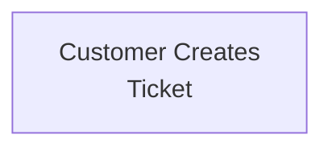
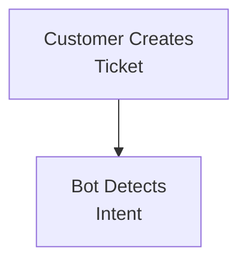
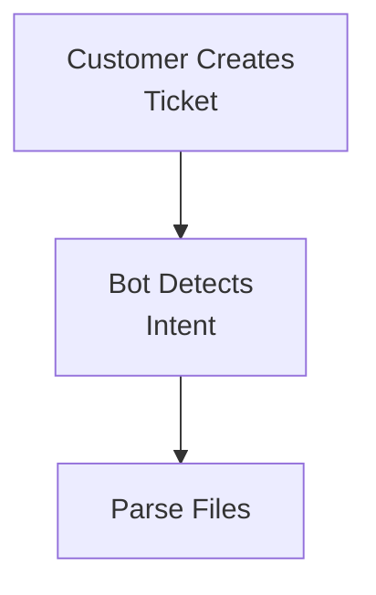
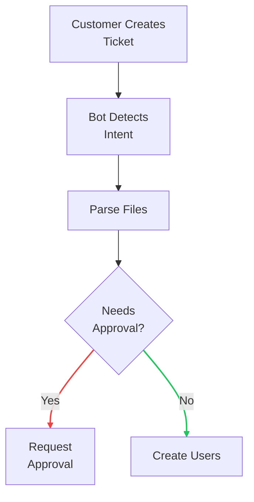
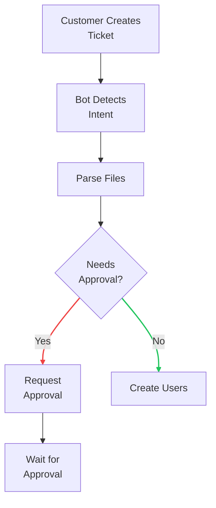
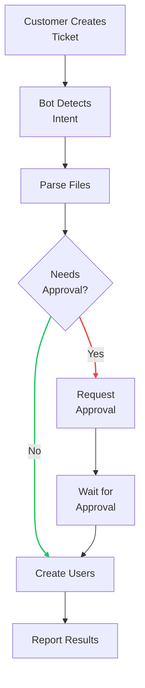

---
layout: two-cols
---

# How It Works
## Customer Success Perspective

<v-clicks>

1. **Customer submits ticket** in Jira with user data file
2. **Bot automatically detects** user upload requests
3. **Processes attachment** (CSV/Excel) with AI assistance
4. **Requests approval** if data transformations needed
5. **Creates users** after approval
6. **Reports results** back to Jira ticket

</v-clicks>

::right::

= 6" class="bg-white dark:bg-gray-800 rounded-lg p-4 shadow-lg w-full flex justify-center">

---
transition: slide-up
---

# Ticket Lifecycle

  

    <h3 class="text-blue-500 font-bold mb-2">Open Status</h3>
    <ul class="text-sm space-y-1">
      <li>✓ New tickets detected</li>
      <li>✓ AI analyzes intent</li>
      <li>✓ Files downloaded & parsed</li>
      <li>✓ Data validated</li>
    </ul>
    

      <strong>Transitions to:</strong>
      
→ Review (approval needed)

      
→ Info Required (no credentials)

    

  

  
  

    <h3 class="text-yellow-500 font-bold mb-2">Review Status</h3>
    <ul class="text-sm space-y-1">
      <li>⏳ Waiting for approval</li>
      <li>📎 Proposed CSV attached</li>
      <li>🔄 Column mappings shown</li>
      <li>💬 Reply "approved" to proceed</li>
    </ul>
    

      <strong>Transitions to:</strong>
      
→ Done (upload successful)

      
→ Info Required (failures)

    

  

  
  

    <h3 class="text-red-500 font-bold mb-2">Info Required</h3>
    <ul class="text-sm space-y-1">
      <li>🔐 Missing 1Password entry</li>
      <li>❌ Upload failures occurred</li>
      <li>📝 Setup instructions posted</li>
    </ul>
    

      <strong>Message examples:</strong>
      
"User upload completed with 3 failures"

      
"No 1Password entry found"

    

  

  <strong>Automatic Transitions:</strong>
  Open→Review (needs approval) • Review→Done (success) • Any→Info Required (errors/missing creds)

---

# Smart File Processing

## Simple Mode (Direct)
Files with exact column matches:
- `email`
- `first name` 
- `last name`
- `job title`
- `mobile number`
- `teams`
- `user role`

  ✓ Deterministic system

## Complex Mode (AI-Assisted)
Handles challenging scenarios:
- Multi-sheet Excel files
- Headers not in first row
- Instruction rows before data
- Non-standard column names
- Sheet structure detection

  🤖 LLM driven data extraction

---

# Real-World Excel Parsing Challenge

  <h3 class="text-xl font-semibold">Multi-Sheet Excel with Complex Structure</h3>
  
The AI agent navigates through multiple sheets to find and extract user data

  

    <h4 class="text-lg font-bold mb-2 text-orange-500">Sheet 1: Team Configuration</h4>
    
    

      <ul>
        <li>❌ Not user data - just team escalation settings</li>
        <li>🔍 AI recognizes this is configuration, not users</li>
      </ul>
    

  

  
  

    <h4 class="text-lg font-bold mb-2 text-green-500">Sheet 2: User Data</h4>
    
    

      <ul>
        <li>📝 Rows 1-3: Instructions for humans</li>
        <li>📊 Row 5: Actual headers start here</li>
        <li>👥 Row 6+: User data begins</li>
        <li>✅ AI correctly identifies and extracts from row 5 onwards</li>
      </ul>
    

  

  

    🎯 AI Capabilities Demonstrated
  

  

    

      
Sheet Detection

      
Finds the right sheet with user data

    

    

      
Structure Analysis

      
Skips instruction rows automatically

    

    

      
Column Mapping

      
Maps "USER Role" → "user role"

    

  

---

# Approval Request Comment

  <h3 class="text-xl font-semibold">Structured Approval Request</h3>
  
The agent posts a detailed comment with all processing information

  

---

# Approval Request Comment

  <h3 class="text-xl font-semibold">Structured Approval Request</h3>
  
The agent posts a detailed comment with all processing information

  

    
🔍

    
Full Transparency

    
See exactly what was processed

  

  

    
📎

    
CSV Attachment

    
Review the clean data

  

  

    
✅

    
Simple Approval

    
Just reply "approved"

  

---

# Human-in-the-Loop Approval

  <h3 class="text-xl font-semibold">You Stay in Control</h3>
  
After AI processing, the agent creates a clean CSV proposal for your review

  

--- #11

  

    <h4 class="font-bold text-green-600 dark:text-green-400 mb-2">✅ What Happened</h4>
    <ul class="text-sm space-y-1">
      <li>📥 Original Excel file processed (Complex multi-sheet)</li>
      <li>🤖 AI mapped columns and extracted data</li>
      <li>📝 Clean CSV created: <code>users-for-approval.csv</code></li>
      <li>🔍 Attached to ticket for review</li>
      <li>⏳ Status changed to "Review"</li>
    </ul>
  

  
  

    <h4 class="font-bold text-blue-600 dark:text-blue-400 mb-2">🎯 Next Steps</h4>
    <ul class="text-sm space-y-1">
      <li>👀 Review the proposed CSV file</li>
      <li>✔️ Verify data looks correct</li>
      <li>💬 Reply with <strong>"approved"</strong> to proceed</li>
      <li>🚀 Agent will then create all users</li>
      <li>📊 Final report posted when complete</li>
    </ul>
  

  

    
🛡️

    

      
Safety First

      
No users are created until you explicitly approve the proposed data

    

  

---

# Jira Comment Integration

  <h3 class="text-xl font-semibold">Automated Status Updates</h3>
  
The agent posts detailed comments at every stage

  

    <h4 class="text-lg font-bold mb-2 text-green-500">✅ Successful Upload</h4>
    
    

      
• Clear summary of results

      
• Created vs existing users

      
• Team creation details

      
• Automatic ticket transition

    

  

  
  

    <h4 class="text-lg font-bold mb-2 text-orange-500">🔐 Missing Credentials</h4>
    
    

      
• Clear setup instructions

      
• 1Password entry format

      
• Service account pattern

      
• Transitions to "Info Required"

    

  

  

    <strong>⚠️ Important 1Password Setup:</strong>
    
Credentials must be stored in the <code class="px-1 py-0.5 bg-gray-200 dark:bg-gray-700 rounded">Customer Success (Site Registrations)</code> vault

    
Format: <code>customersolutions+tenant@jesi.io</code>

  

  <strong>Full Audit Trail:</strong> Every action is documented in Jira for compliance and troubleshooting

