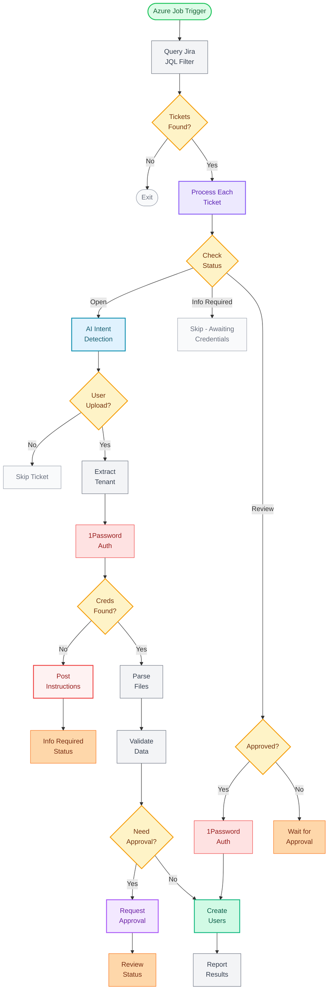

# Developer Deep Dive

## Technical Architecture & Implementation

<div class="text-gray-500 mt-4">
  Let's explore the technical details
</div>

---

# Technical Stack

<div class="grid grid-cols-2 gap-8 mt-8">
<div>

## Core Technologies
- **Language:** Clojure (functional, JVM-based)
- **Deployment:** Docker container on Azure
- **Scheduling:** Azure Job (max parallel: 1)
- **AI:** Claude for intent & mapping
- **Auth:** 1Password CLI for credentials

</div>
<div>

## Configuration Details
- **Team Escalation:** 180 minutes (3 hours)
- **Single Instance:** Prevents race conditions
- **Batch Processing:** All tickets per wake
- **JQL Keywords:** Configurable via config.edn
- **Attachment Limit:** 30MB per file

</div>
</div>

<div v-click class="mt-6">

## Key Implementation Details

<div class="grid grid-cols-2 gap-4 mt-4 text-sm">
<div class="p-3 bg-gray-100 dark:bg-gray-800 rounded">
<strong>Team Creation Structure:</strong>
```clojure
{:name "Team Name"
 :members [current-user-id]
 :escalationLevels 
   [{:minutes 180
     :escalationContacts [...]}]}
```
</div>
<div class="p-3 bg-gray-100 dark:bg-gray-800 rounded">
<strong>Tenant Extraction Priority:</strong>
```text
1. customersolutions+tenant@jesi.io
2. "Tenant: tenant-name" (in text)
3. tenant.jesi.io (subdomain)
```
</div>
</div>

</div>

---

# Processing Workflow

<div class="flex flex-col items-center">

<div style="height: 50vh; overflow-y: scroll; overflow-x: hidden; margin-top: 0.5rem; background: #f8f9fa; padding: 1rem; border-radius: 0.5rem; border: 1px solid #e5e7eb;">



<div style="height: 200px; width: 100%;">&nbsp;</div>
</div>

<div class="mt-4 flex justify-center gap-6 text-xs">
  <div class="flex items-center gap-1"><span class="inline-block w-3 h-3 bg-green-400 rounded"></span>Start/Success</div>
  <div class="flex items-center gap-1"><span class="inline-block w-3 h-3 bg-yellow-400 rounded"></span>Decision</div>
  <div class="flex items-center gap-1"><span class="inline-block w-3 h-3 bg-blue-400 rounded"></span>Processing</div>
  <div class="flex items-center gap-1"><span class="inline-block w-3 h-3 bg-red-400 rounded"></span>Error/Auth</div>
</div>

</div>

---

# Intent Detection prompt

<div class="overflow-y-auto max-h-100">
```text
You are analyzing a Jira ticket to determine if it represents a user upload request.

A user upload request is a ticket asking to add, import, or upload user data (employees, team members, etc.) to a system, typically from a file like CSV or Excel.

Analyze the ticket information provided and determine if this is a user upload request.

Consider:
- Ticket summary and description content
- Attachment file names and types
- Keywords like "upload", "import", "add users", "new employees", "bulk users", etc.
- File extensions like .csv, .xlsx, .xls that commonly contain user data

Return ONLY JSON in this exact format with no additional text:
{"is_user_upload": <true/false>}

Examples:

Ticket: "Upload new team members" with attachment "employees.xlsx"
Response: {"is_user_upload": true}

Ticket: "Login page broken" with no attachments
Response: {"is_user_upload": false}

Ticket: "System performance issues" with attachment "performance-log.txt"
Response: {"is_user_upload": false}
```
</div>

---

# Column Mapping Prompt

<div class="overflow-y-auto max-h-100 ">
```text
You are mapping file column headers to a standardized user schema.

You will be given:
1. A list of expected standard field names
2. A list of actual column headers from a file

Your task is to match each file header to the most appropriate expected field, or identify which expected fields have no match.

Common mappings:
- "Email Address", "E-mail", "Mail" → "email"  
- "FirstName", "First Name", "Given Name" → "first name"
- "LastName", "Surname", "Family Name" → "last name"
- "Position", "Role", "Title" → "job title" 
- "Phone", "Mobile", "Cell" → "mobile number"
- "Team", "Department", "Group" → "teams"
- "Access Role", "Permission Level" → "user role"

Be flexible with variations in:
- Case (upper/lower)
- Spacing vs underscores vs hyphens
- Abbreviations and synonyms
- Extra words ("User Email" → "email")

Return ONLY JSON in this exact format with no additional text:
{
  "mapping": {
    "<file-header>": "<expected-field>",
    "<file-header>": "<expected-field>"
  },
  "unmapped": ["<expected-field>", "<expected-field>"]
}
```
</div>

---

# Sheet Detection Prompt

<div class="overflow-y-auto max-h-100">
```text
You are analyzing an Excel file to find user data for upload to a system.

Your task is to identify:
1. Which sheet contains the user data
2. Which row contains the column headers
3. Which row the actual data starts

Expected user data columns include:
- Email addresses
- First and last names
- Job titles or roles
- Phone/mobile numbers
- Team assignments
- User permission roles (like "Administrator", "Team Member", etc.)

The file may have:
- Multiple sheets (some may be configuration or notes)
- Instruction rows before the actual headers
- Empty rows between sections
- Merged cells or formatting that creates empty columns

Analyze the provided Excel structure and return ONLY a JSON response in this exact format:
{
  "sheet_name": "<name of sheet with user data>",
  "header_row": <0-based index of header row>,
  "data_start_row": <0-based index of first data row>,
  "confidence": "<high|medium|low>",
  "reasoning": "<brief explanation of why you chose this sheet and rows>"
}
```
</div>

---

# Error Summary Prompt

<div class="overflow-y-auto max-h-100">
```text
You are summarizing user upload validation errors for a Jira ticket comment.

You will be given a list of validation errors that occurred while processing user data.

Create a concise summary suitable for posting as a Jira comment that:
- Gives an overall summary of what went wrong
- Lists the main error categories with bullet points
- Is professional and actionable
- Helps the requester understand what needs to be fixed

Return ONLY JSON in this exact format with no additional text:
{
  "summary": "<brief overall summary>",
  "bullet_points": [
    "<error category 1>", 
    "<error category 2>",
    "<specific details if needed>"
  ]
}

Example:

Errors: [{"email": "john@", "reason": "Invalid email format"}, {"email": "jane@test.com", "reason": "Duplicate email"}, {"email": "bob@company.com", "reason": "Role 'Manager' not found"}]

Response:
{
  "summary": "3 users failed validation during upload processing",
  "bullet_points": [
    "1 user with invalid email format",
    "1 user with duplicate email address", 
    "1 user with unrecognized role assignment"
  ]
}
```
</div>


---

# Excel Sheet Detection

<div class="overflow-y-auto max-h-100">
```text
You are analyzing an Excel file to find user data for upload to a system.

Your task is to identify:
1. Which sheet contains the user data
2. Which row contains the column headers  
3. Which row the actual data starts

Expected user data columns include:
- Email addresses
- First and last names
- Job titles or roles
- Phone/mobile numbers
- Team assignments
- User permission roles (like "Administrator", "Team Member", etc.)

The file may have:
- Multiple sheets (some may be configuration or notes)
- Instruction rows before the actual headers
- Empty rows between sections
- Merged cells or formatting that creates empty columns

Analyze the provided Excel structure and return ONLY a JSON response in this exact format:
{
  "sheet_name": "<name of sheet with user data>",
  "header_row": <0-based index of header row>,
  "data_start_row": <0-based index of first data row>,
  "confidence": "<high|medium|low>",
  "reasoning": "<brief explanation of why you chose this sheet and rows>"
}

Example:
If the analysis shows:
- Sheet "Users" has row 0 with instructions
- Row 3 has "Email, First Name, Last Name, Role"
- Row 4 starts with actual user data

Response:
{
  "sheet_name": "Users",
  "header_row": 3,
  "data_start_row": 4,
  "confidence": "high",
  "reasoning": "Sheet 'Users' contains email and name columns in row 3, with user data starting in row 4"
}
```
</div>

---

# Multi-Tenant Authentication

<div class="mt-8">

## Tenant-Specific Service Accounts

Each customer has a dedicated service account:
- **Pattern:** `customersolutions+<tenant>@jesi.io`
- **Storage:** 1Password CLI integration
- **Retrieval:** Dynamic per-ticket authentication

</div>

<div v-click class="mt-6 text-yellow-500">
  ⚠️ If credentials missing → Transition to "Info Required" with setup instructions
</div>


---

# Approval Workflow

<div class="grid grid-cols-2 gap-8">
<div>

## Approval Request Format
```markdown
[BOT:user-upload:approval-request:v2]

**Tenant:** customersolutions+qbirt@jesi.io
**1Password:** ✓ Found

**Summary:**
- Users to create: 118
- Teams involved: 5
- Attachments: 1

**Column Mapping:**
- "Email Address" → "email"
- "FirstName" → "first name"
- "Role" → "user role"

**Fingerprints:**
- users.xlsx: SHA256/Base64
  oK3RHMyZSwLVjCQB2M0DmQ==
  Size: 14,592 bytes

**Attached:** proposed-users.csv

Reply "approved" to proceed
```

</div>
<div v-click>

## Security & Validation

### SHA-256 Fingerprinting
```clojure
(defn bytes-to-sha256 [byte-array]
  (let [digest (MessageDigest/getInstance "SHA-256")
        hash-bytes (.digest digest byte-array)
        encoder (Base64/getEncoder)]
    (.encodeToString encoder hash-bytes)))
```

### Approval Validation
1. Find latest bot request (v2 prefix)
2. Extract SHA-256 fingerprints
3. Check for human "approved" after
4. **Verify files unchanged** (critical!)
5. Proceed only if fingerprints match

<div class="mt-4 p-3 bg-yellow-50 dark:bg-yellow-900/20 rounded text-xs">
⚠️ <strong>If attachments change after approval:</strong>
Approval is invalidated and new approval required
</div>

</div>
</div>

